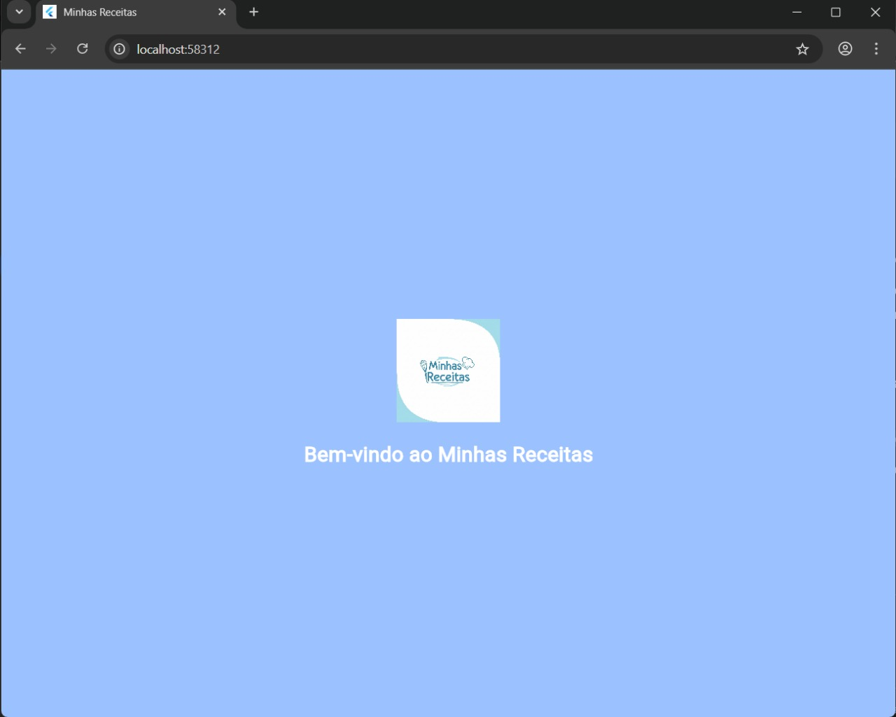
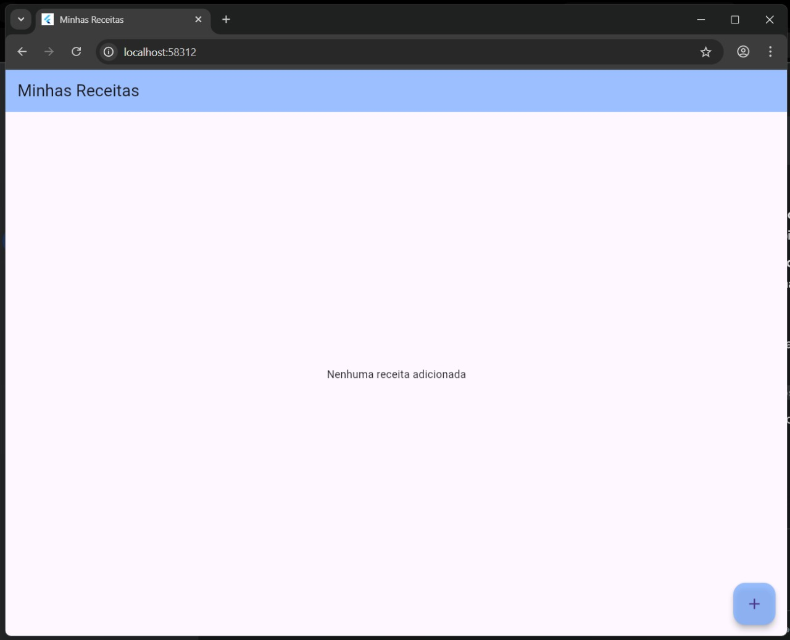
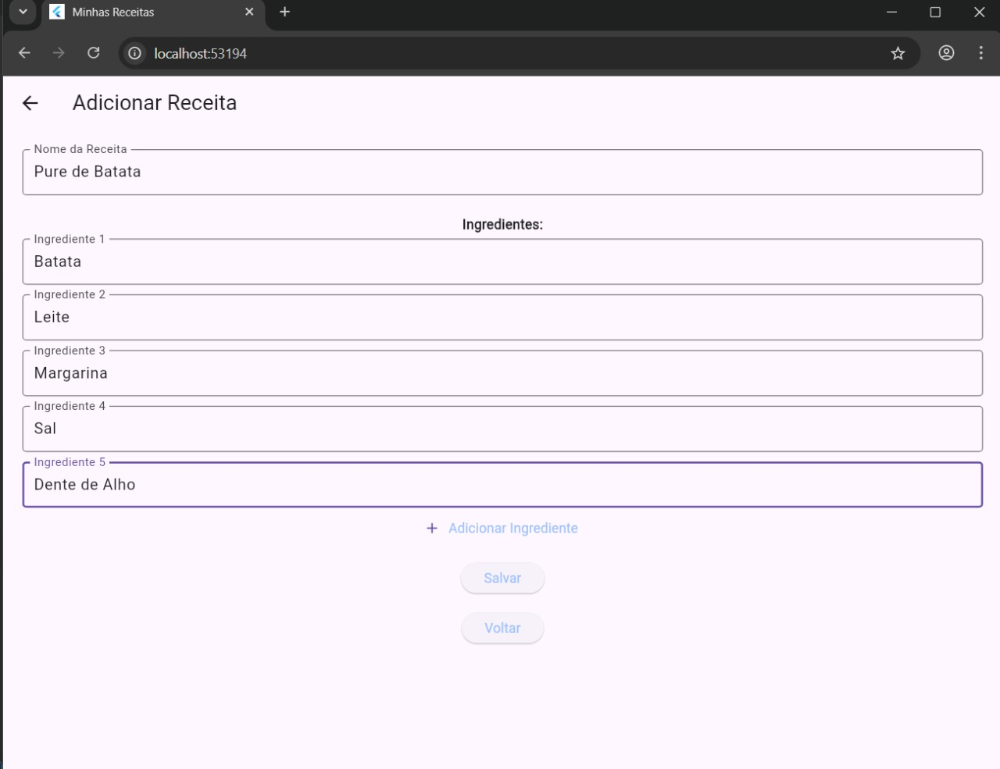
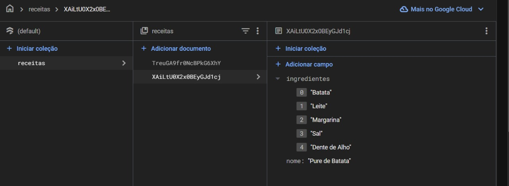

# 🍽️ Minhas Receitas

Aplicativo de receitas feito com **Flutter** e **Firebase Firestore**. Nele, é possível cadastrar receitas informando o nome do prato e uma lista dinâmica de ingredientes, e consultar todas as receitas já registradas.

---

## 🚀 Funcionalidades

- 🔍 **Consultar Receitas:** Visualize as receitas cadastradas na tela principal.
- ➕ **Adicionar Receita:** Crie receitas com múltiplos ingredientes.
- 🧠 **Firestore em tempo real:** Os dados são armazenados e atualizados usando o Firebase.
- 📱 **Experiência amigável:** Interface simples e intuitiva.

---

## 🖼️ Detalhamento das Telas

### 🟡 Splash Screen

- Mensagem de boas-vindas: "Bem-vindo ao Minhas Receitas"
- Exibe o logo centralizado
- Tela de entrada inicial antes de redirecionar automaticamente à tela principal.

📸  


---

### 🟢 Tela Principal (Main)

- Mostra a lista de receitas cadastradas (ou mensagem "Nenhuma receita adicionada")
- Cada receita aparece em um card com nome e ingredientes.
- Botão flutuante de “+” leva à tela de adicionar.

📸  


---

### 🔵 Tela de Adicionar Receita

- Formulário com:
  - Campo para nome da receita
  - Campos dinâmicos para ingredientes
  - Botões de adicionar ingrediente, salvar e voltar

📸  


---

### ☁️ Firebase Firestore

- As receitas são salvas na coleção `receitas`
- Cada documento possui campos:
  - `nome`: string
  - `ingredientes`: lista de strings

📸  


---

## 📁 Estrutura do Projeto

```text
lib/
├── main.dart                # Tela principal com receitas
├── splash_screen.dart       # Tela inicial de boas-vindas
├── adicionar_receita.dart   # Formulário de criação
├── firebase_service.dart    # Lógica Firebase
